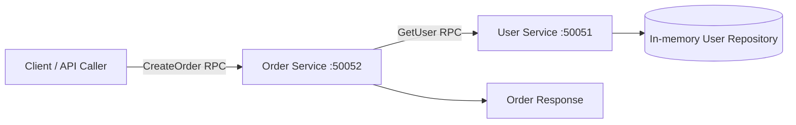

# gRPC POC

This project shows a small gRPC-based service flow built with Node.js, TypeScript, `@grpc/grpc-js`, and `@grpc/proto-loader`.

The main goal is simple: an order request is received, the order service checks the user service, and then returns a confirmed order response.

## Project at a Glance

- `user-service` owns user lookup logic and keeps user data in memory.
- `order-service` accepts create-order requests and validates the user first.
- `shared/proto-loader.ts` loads `.proto` files in a reusable way.
- `proto/` contains the gRPC contracts that define messages and RPCs.

## Architecture



## Workflow

1. A client sends a `CreateOrder` request with `user_id`, `product`, and `quantity`.
2. The order service receives the request on port `50052`.
3. The order service calls the user service on port `50051`.
4. The user service looks up the user in the in-memory repository.
5. If the user exists, the order service builds a confirmed order response.
6. If the user does not exist, the order flow fails with a validation-style error.

## Service Responsibilities

### User Service

- Exposes the user lookup RPC defined in `proto/user.proto`.
- Reads user data from `src/user-service/user.repository.ts`.
- Returns user details when the ID exists.
- Returns `NOT_FOUND` when the user is missing.

### Order Service

- Exposes the order creation RPC defined in `proto/order.proto`.
- Calls the user service before creating an order.
- Converts missing-user errors into a clear business-level failure.
- Returns the order ID, status, and customer name when validation succeeds.

### Shared Proto Loader

- Loads proto files from the `proto/` folder.
- Keeps proto loading logic consistent across services.
- Reduces repeated setup code in each service.

## Folder Structure

- `proto/` - gRPC contracts for user and order flows.
- `src/shared/` - reusable helpers used by multiple services.
- `src/user-service/` - user lookup service, repository, and server entrypoint.
- `src/order-service/` - order workflow service and server entrypoint.
- `src/gateway/` - placeholder area for future API gateway or client composition.
- `src/product-service/` - placeholder for future product workflow expansion.

## Step-by-Step Guide

### 1. Install dependencies

```bash
npm install
```

### 2. Start the user service

```bash
npx ts-node src/user-service/server.ts
```

### 3. Start the order service

```bash
npx ts-node src/order-service/server.ts
```

### 4. Send a create-order request

- Use a gRPC client such as `grpcurl`, Postman, or a custom Node client.
- Call the `CreateOrder` RPC on the order service.
- Pass a valid `user_id` such as `1` or `2` to get a successful response.

### 5. Observe the result

- Valid user ID: the response returns `CONFIRMED` with the user's name.
- Invalid user ID: the request fails because the user service returns `NOT_FOUND`.

## Proto Contracts

### `proto/user.proto`

- Defines the `UserService` contract.
- Uses `GetUserRequest` and `GetUserResponse` messages.
- Keeps the user lookup API small and focused.

### `proto/order.proto`

- Defines the `OrderService` contract.
- Uses `CreateOrderRequest` and `CreateOrderResponse` messages.
- Includes `user_id`, `product`, and `quantity` as input fields.

## Current Sample Data

- User `1` - Rahim Uddin, `rahim@shop.com`
- User `2` - Karim Hossain, `karim@shop.com`

## Notes

- The services run over insecure local gRPC channels, which is fine for development only.
- Keep RPC names in the proto files and service handlers aligned when you add new methods.
- If you expand the project, `src/gateway/` is a good place for a client-facing API layer.

## Suggested Next Steps

- Add a client script to call the order service from the command line.
- Add product service logic and connect it to the order flow.
- Replace the in-memory repository with a database-backed implementation.
- Add automated tests for the user lookup and order validation paths.
